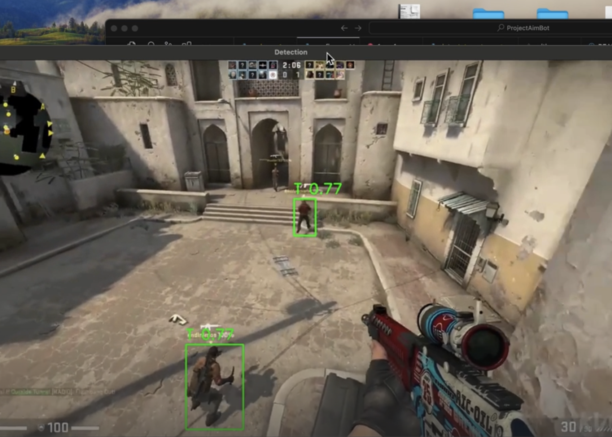

## AI Aim Assistant

This project implements an AI-powered aim assistance system using computer vision and real-time object detection. It uses YOLO for target detection and provides a transparent overlay window for game integration.

[](https://streamable.com/mrcd2r)


### Key Features

- Real-time target detection using YOLO
- Transparent overlay window for game integration
- Configurable aim assistance with customizable parameters
- Smooth mouse movement with acceleration control
- FPS counter and performance monitoring
- Resizable and draggable interface


### Technical Implementation

#### Detection System
- Uses YOLO for real-time object detection
- Processes screen captures in real-time
- Optimized for gaming performance with GPU acceleration when available
- Configurable confidence and IOU thresholds

#### Aim Assistance Logic
1. **Screen Capture**
   - Captures game screen within the overlay window
   - Processes frames in real-time using a separate thread
   - Maintains high FPS for smooth operation

2. **Target Detection**
   - Detects potential targets using YOLOv8
   - Filters targets based on confidence scores
   - Prioritizes targets based on distance to center

3. **Aim Calculation**
   - Calculates optimal aim point (typically upper body/head area)
   - Applies vertical offset for better target acquisition
   - Converts game coordinates to screen coordinates

4. **Mouse Control**
   - Implements smooth mouse movement using acceleration curves
   - Uses pyautogui for precise mouse control
   - Configurable movement speed and smoothing

5. **User Interface**
   - Transparent overlay window
   - Real-time FPS counter
   - Visual feedback for detected targets
   - Status indicators for aim assistance
   
   

### Setup

1. Clone the repository:
   ```bash
   git clone <repository-url>
   cd <project-directory>
   ```

2. Create and activate virtual environment:
   ```bash
   python3 -m venv venv
   source venv/bin/activate  # On Windows: venv\Scripts\activate
   ```

3. Install requirements:
   ```bash
   pip install -r requirements.txt
   ```


### Usage

#### main.py( For video test )

1. Run the main application:
   ```bash
   python src/main.py
   ```

2. press 'q' to quit

#### screen_detector.py( For aiming bot )

1. Run the main application:

   ```bash
   python src/screen_detector.py.py
   ```

2. Position the overlay window over your game

3. Press 'Start Detection' to begin target detection

4. Use '[' key to trigger aim assistance when targets are detected

### 

### Configuration

Adjust settings in `src/config.py`:
- Model path and parameters
- Detection thresholds
- Aim sensitivity and smoothing
- Window size and opacity


### Project Structure

```
├── src/
│   ├── main.py              # Main application entry
│   ├── detect_targets.py    # Target detection implementation
│   ├── screen_detector.py   # Screen capture and aim logic
│   └── config.py           # Configuration settings
├── models/                  # YOLOv8 model files
└── requirements.txt        # Project dependencies
```


#### **Training tool**

Data Resource: roboflow (https://universe.roboflow.com/roboflow-100/csgo-videogame)

Trainning Model: ultralytics+Colab

Monitor: wandb.ai


#### **Dependency reference**

python3 -m venv venv

Active venv: source venv/bin/activate

(Pip install reference)

pip install torch torchvision torchaudio

pip install opencv-python opencv-python-headless

pip install requests # For dataset fetching

pip install matplotlib # For visualizations if needed

git clone https://github.com/ultralytics/yolov5

pip install -r yolov5/requirements.txt
